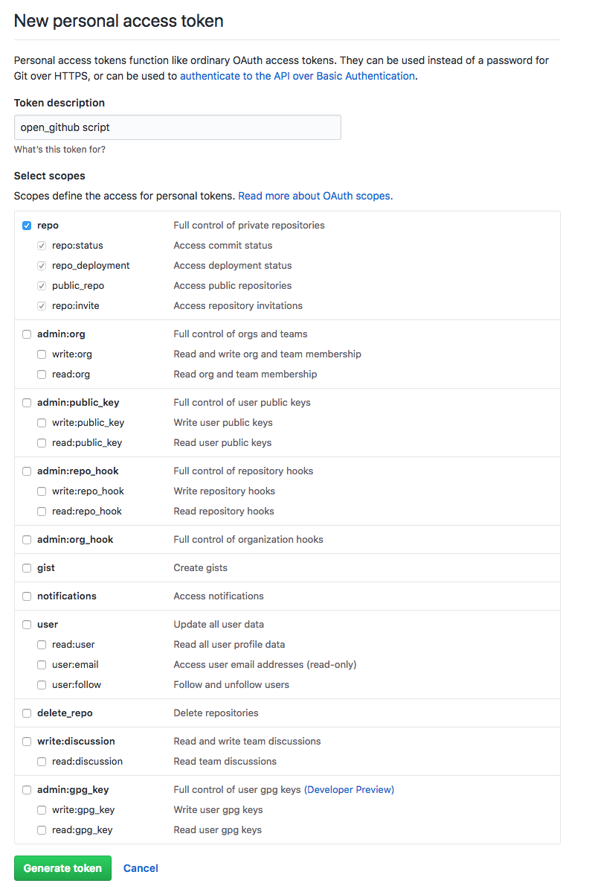

#### open_github
> A plugin for the [fish-shell](https://fishshell.com).

[](/LICENSE)
[](https://fishshell.com)
[](https://www.github.com/oh-my-fish/oh-my-fish)

<br/>

Navigate to the GitHub pages for your branches from the command line! Say that you are working with a remote repository called `Repo` that is owned by `Org`. And you are on a branch called `branch` for which a PR has been created with id `32`. `open_github` provides a shortcut to open the current branch's 

- pull request page ([https://github.com/Org/Repo/pull/32]())
- tree view ([https://github.com/Org/Repo/tree/branch]())

in your browser. Should work on macOS and Linux.

## Install
### Basic installation
If you only want to be able to open the tree view for the current branch on GitHub, you only need to install the plugin.

With [fisher]
```
fisher add patrickf3139/open_github
```
With [Oh My Fish]
```fish
omf install open_github
```
### Installing open PR functionality
If you want to be able to open the pull request created for the current branch on GitHub, you will need to do a bit more set up. The first step is to obtain a GitHub Personal Access token and set it as an environment variable. This is needed because `open_github` queries the [GitHub API](https://developer.github.com/v3/pulls/#list-pull-requests) to get information about your repositories' pull requests. See the section below for further instructions. The second is to install [gron](https://github.com/tomnomnom/gron), which is used to parse the JSON returned by GitHub's API:
```fish
brew install gron
```

#### Providing GitHub Credentials
Follow GitHub's directions for creating a personal access token [here](https://help.github.com/articles/creating-a-personal-access-token-for-the-command-line).
These are the minimal permissions the token will need:
<table><tr><td>
    
</td></tr></table>

If you work with repositories protected by SSO, make sure you follow step 10. Or see the directions [here](https://help.github.com/articles/authorizing-a-personal-access-token-for-use-with-a-saml-single-sign-on-organization).

After you have obtained a token, assign it to the environment variable `GITHUB_AUTH_TOKEN` like so in your `config.fish` (or similar) so that `open_github` can access it:
```fish
set -x GITHUB_AUTH_TOKEN <insert token here>
```

## Usage
The `github` command only works when your working directory is a git repository that has a GitHub upstream configured. To open the tree view for the current branch, run
```fish
github
```
If GitHub 404s, make sure you have pushed the current branch.

To open the pull request for the current branch, run
```fish
github --pr
```
If the command fails, double check that your access token is valid and that a pull request has been opened for the current branch. Note that if multiple pull requests have been created for the current branch, the latest PR will be used.

Think you've found a bug? Please run in debug mode with the `-d` flag and open an issue with the debug log.

[fisher]: https://github.com/jorgebucaran/fisher
[Oh My Fish]: https://github.com/oh-my-fish/oh-my-fish
